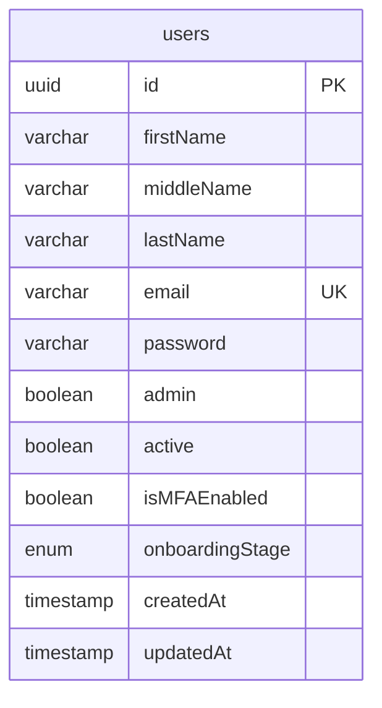

# learning_react
learning_react

```mermaid
erDiagram
    %% Core User Management
    users {
        uuid id PK
        varchar firstName
        varchar middleName
        varchar lastName
        varchar email UK
        varchar password
        boolean admin
        boolean active
        boolean isMFAEnabled
        enum onboardingStage
        timestamp createdAt
        timestamp updatedAt
    }
```
